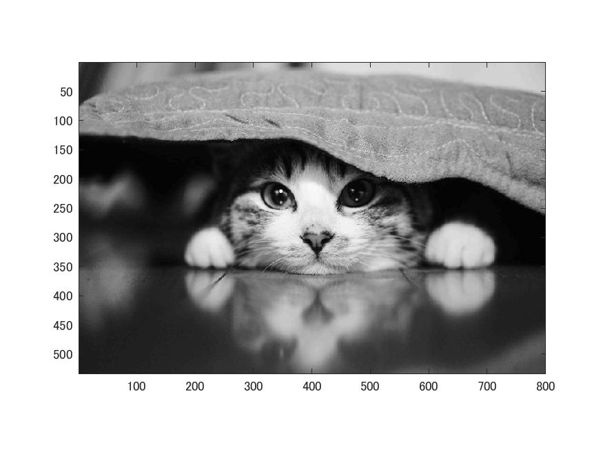
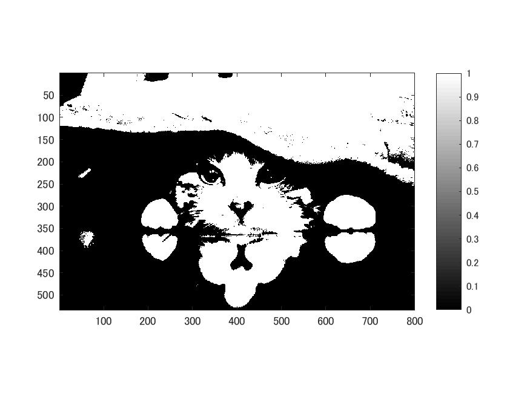
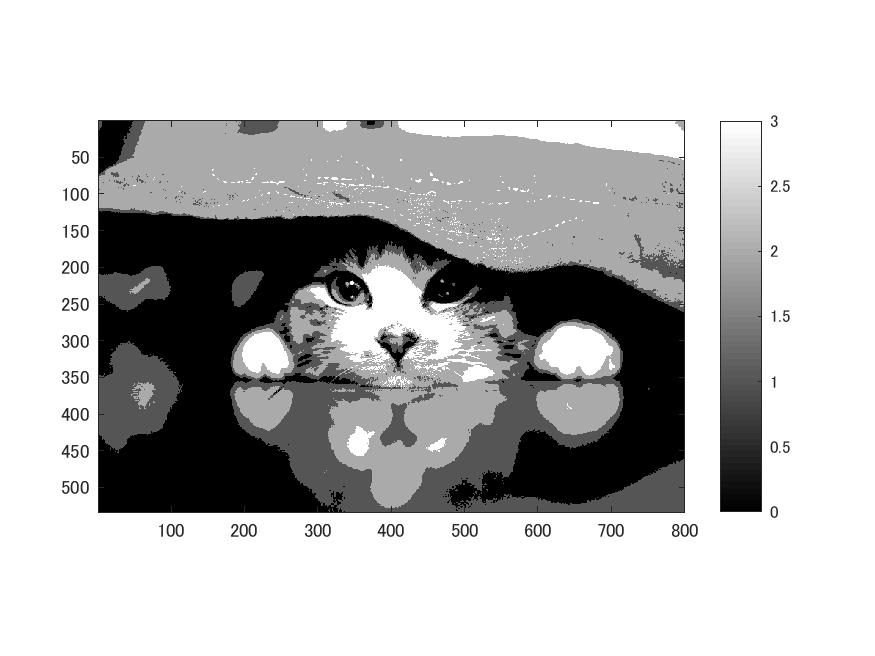

# 課題2　階調数と疑似輪郭  
ここでは使用画像Nuko.jpgの白黒画像に対し 
２階調，４階調，８階調の画像を生成する。  
そのためまず、以下のコードを記述する。  
  
>> ORG = imread('Nuko.jpg');%画像をIMG変数に格納  
>> IMG = rgb2gray(ORG); colormap(gray); colorbar;  
>> imagesc(IMG); axis image; % 画像の表示  
>> pause; % 一時停止  
  
使用原画像の白黒画像を図1に示す。  
  
図1 白黒画像  
  
## 2階調  
2階調画像作成のため次のコードを記述する。  
  
>> IMG2 = IMG>128;  
>> imagesc(IMG2); colormap(gray); colorbar;  axis image;  
>> pause;  
  
2階調画像を図2に示す。  
   
図2 二階調画像  
  
## 4階調  
4階調画像作成のため次のコードを記述する。   
  
>> IMG3 = IMG>64;  
>> IMG4 = IMG>128;  
>> IMG5 = IMG>192;  
>> IMG6 = IMG3 + IMG4 + IMG5;  
>> imagesc(IMG6); colormap(gray); colorbar;  axis image;  
   
4階調画像を図3に示す。  
   
図3 4階調画像  
  
## 8階調  
同様に、8階調画像作成のため次のコードを記述する。 
  
>> IMG3 = IMG>32;  
>> IMG4 = IMG>64;  
>> IMG5 = IMG>96;  
>> IMG6 = IMG>128;  
>> IMG7 = IMG>160;  
>> IMG8 = IMG>192;  
>> IMG9 = IMG>224;  
>> IMG10 = IMG3 + IMG4 + IMG5 + IMG6 + IMG7 + IMG8 + IMG9;  
>> imagesc(IMG10); colormap(gray); colorbar;  axis image;  
  
8階調画像を図4に示す。  
  
図4 8階調画像
