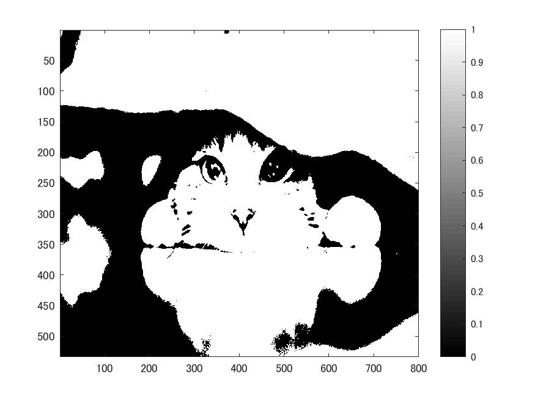
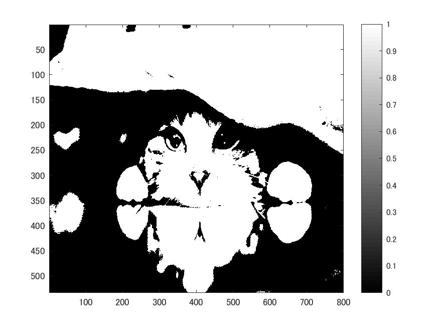
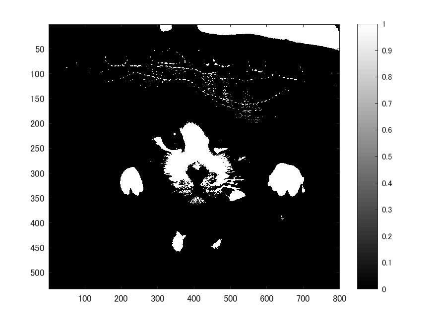

# 課題3 閾値処理  
ここでは閾値を4パターン設定した状態の画像を表示し確認する。  

  課題2同様、白黒画像を用いる為次のコードを記述する。  
  
>> ORG = imread('Nuko.jpg');  
>> ORG= rgb2gray(ORG);  
>> imagesc(ORG); colormap(gray); colorbar;  
>> pause;  
  
図1 白黒画像  
  
次に閾値が64の画像、つまり輝度値が64以上の画素を1,その他を0とした画像を作成する。
  
>> IMG = ORG > 64;  
>> imagesc(IMG); colormap(gray); colorbar;  
>> pause;  
  
  
図2 閾値64の画像  
  
閾値96,128,192の画像も同様に行う。  
結果を図3~5に示す。  
  
図3 閾値96の画像  
  
図4 閾値128の画像  
  
図5 閾値192の画像  
