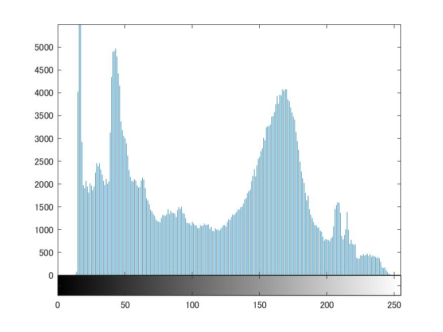

# 課題4 画像のヒストグラム  
ここでは、画像の濃度ヒストグラムを表示して、確認する。
  
課題2同様、白黒画像を用いる為次のコードを記述する。  
  
>> ORG = imread('Nuko.jpg');  
>> ORG= rgb2gray(ORG);  
>> imagesc(ORG); colormap(gray); colorbar;   
>> pause;  
  
  
図1 白黒画像  
  
imhist()関数を用いて白黒画像から濃度ヒストグラムを作成する。  
  
>> imhist(ORG);  
  
    
図2 濃度ヒストグラム
