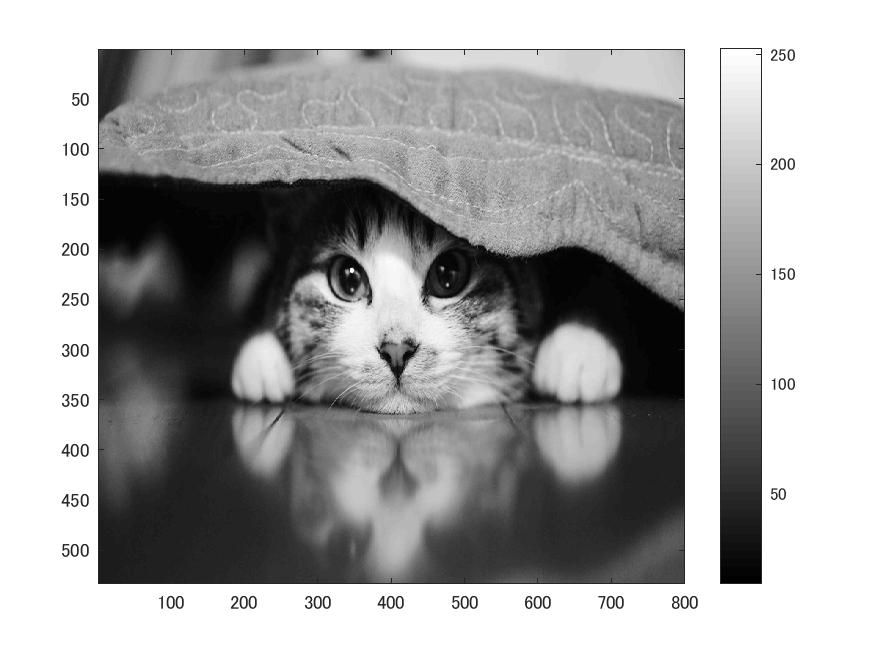
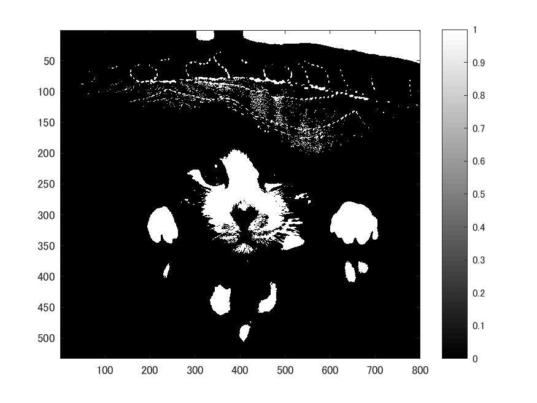

# 課題5 判別分析法  
ここでは、判別分析法について、MATLABを用いて実際に処理を行ってみる。  
  課題2同様、白黒画像を用いる為次のコードを記述する。  
  
>> ORG = imread('Nuko.jpg');  
>> ORG= rgb2gray(ORG);  
>> imagesc(ORG); colormap(gray); colorbar;   
>> pause;  
  
  
図1 白黒画像  
  
白黒画像に対し、判別分析法を適用させるため、次のコードを記述する。
  
>> H = imhist(ORG);  
myu_T = mean(H);  
max_val = 0;  
max_thres = 1;  
for i=1:255  
C1 = H(1:i);  
C2 = H(i+1:256);  
n1 = sum(C1);  
n2 = sum(C2);  
myu1 = mean(C1);  
myu2 = mean(C2);  
sigma1 = var(C1);  
sigma2 = var(C2);  
sigma_w = (n1 *sigma1+n2*sigma2)/(n1+n2);  
sigma_B = (n1 *(myu1-myu_T)^2+n2*(myu2-myu_T)^2)/(n1+n2);  
if max_val<sigma_B/sigma_w  
max_val = sigma_B/sigma_w;  
max_thres =i;  
end;  
end;  
>> IMG = ORG > max_thres;  
imagesc(IMG); colormap(gray); colorbar;  
pause;  
  
結果を図2に示す。  
  
図2 判別分析法
