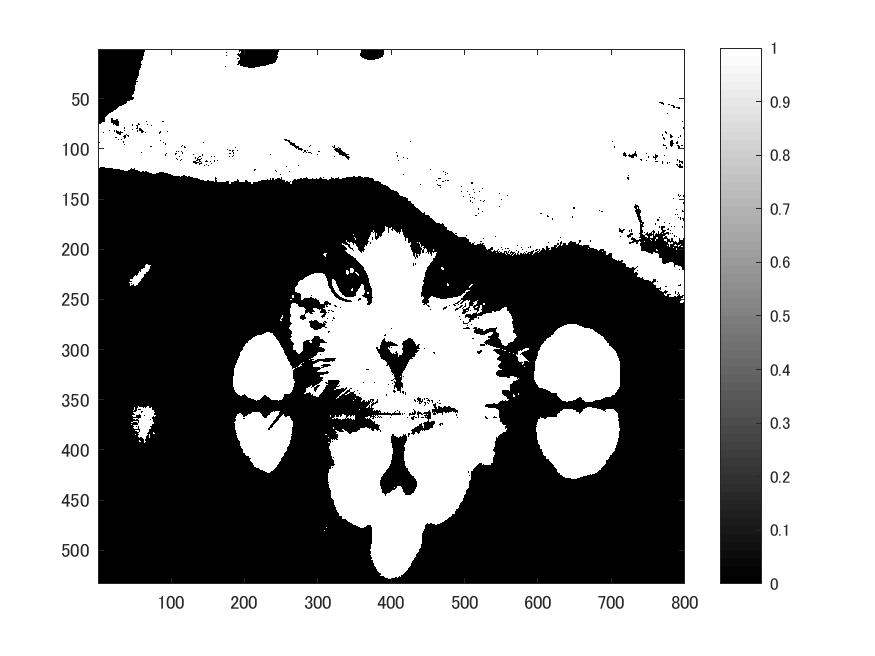
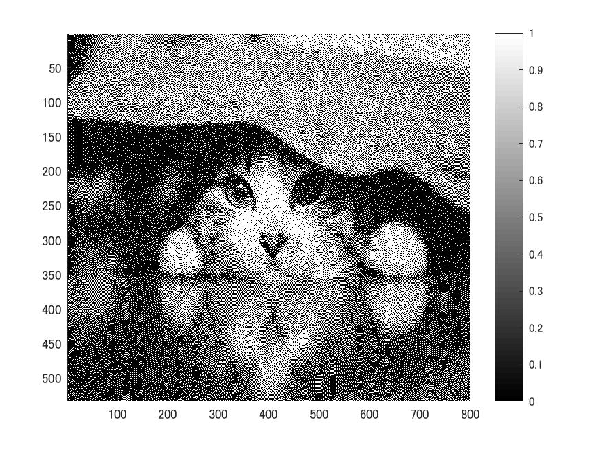

# 課題6 画像の二値化  
ここでは、画像の2値化を「閾値による2値化」と「ディザー法による2値化」の二つの手法で行う。  
課題2同様、白黒画像を用いる為次のコードを記述する。

>> ORG = imread('Nuko.jpg');  
ORG= rgb2gray(ORG);  
imagesc(ORG); colormap(gray); colorbar;  
pause;  
  
  
図1 白黒画像  
  
## 閾値128による二値化
  
>> IMG = ORG>128;  
imagesc(IMG); colormap(gray); colorbar;  
pause;  
  
    
図2 閾値128による二値化  
  
## ディザー法による2値化  
  
>> IMG = dither(ORG);  
imagesc(IMG); colormap(gray); colorbar;  
  
    
図3 ディザー法による2値化  
