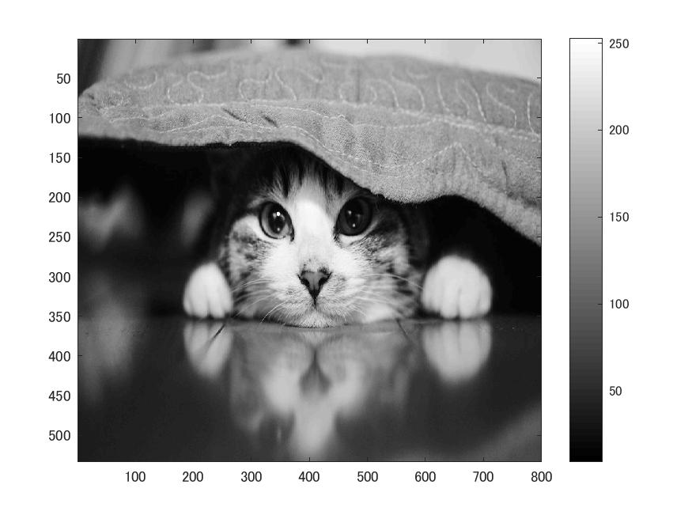
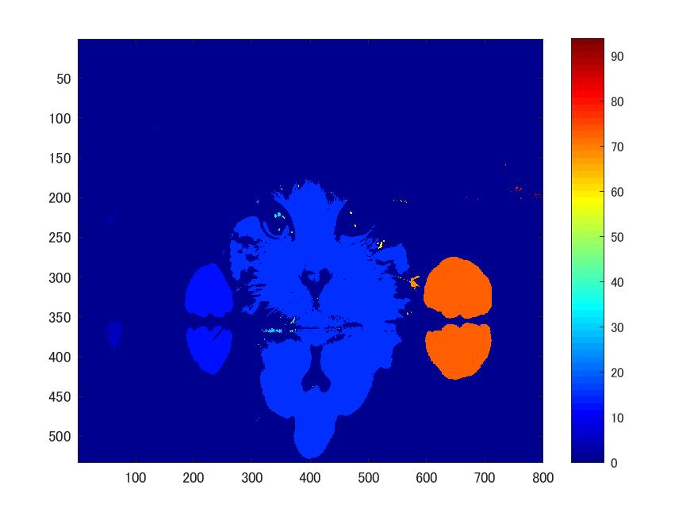

# 課題８ ラベリング  
ここでは、二値化処理された画像のラベリングを確認する。  
  課題2同様、白黒画像を用いる為次のコードを記述する。  
  
>> ORG = imread('Nuko.jpg');  
>> ORG= rgb2gray(ORG);  
>> imagesc(ORG); colormap(gray); colorbar; % 画像の表示  
>> pause;  
  
  
図1 白黒画像  
  
画像の二値化も行う。  
  
>> IMG = ORG > 128;  
imagesc(IMG); colormap(gray); colorbar;  
pause;  
  
  
図2 .閾値による2値化  
  
二値化された画像に対してラベリングする。  
  
>> IMG = bwlabeln(IMG);  
imagesc(IMG); colormap(jet); colorbar;  
pause;  
  
  
図3 ラベリング処理
