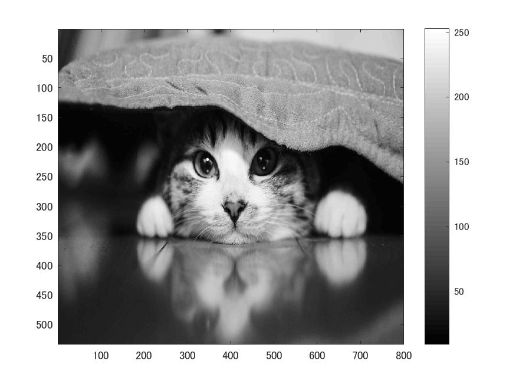
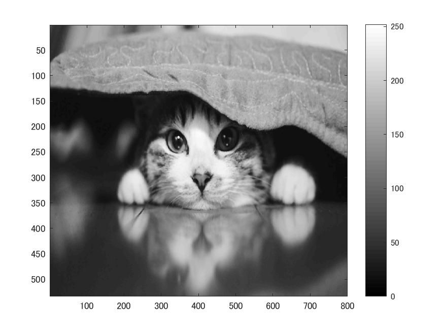
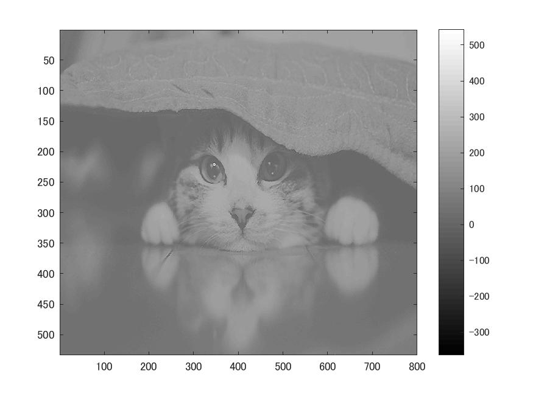

# 課題９ メディアンフィルタと先鋭化  
ここでは、メディアンフィルタによる画像のノイズ除去と鮮鋭化フィルタを用いた画像処理について確認する。  
  課題2同様、白黒画像を用いる為次のコードを記述する。  
  
>> ORG = imread('Nuko.jpg');  
>> ORG= rgb2gray(ORG);  
>> imagesc(ORG); colormap(gray); colorbar;  
>> pause;  
  
  
図1 白黒画像  
  
## ノイズ添付  
  
>> ORG = imnoise(ORG,'salt & pepper',0.02);  
imagesc(ORG); colormap(gray); colorbar;  
pause;  
  
  
図2 ノイズ添付画像  
  
## 平滑化フィルタでの雑音除去  
  
>> IMG = filter2(fspecial('average',3),ORG);  
imagesc(IMG); colormap(gray); colorbar;   
pause;  
  
  
図3 雑音除去後画像(平滑フィルタ)  
  
## メディアンフィルタで雑音除去  
  
>> IMG = medfilt2(ORG,[3 3]);  
imagesc(IMG); colormap(gray); colorbar;  
pause;  
  
  
図4 雑音除去後画像(メディアンフィルタ)  
　　
## 先鋭化  
  
>> f=[0,-1,0;-1,5,-1;0,-1,0];  
IMG = filter2(f,IMG,'same');  
imagesc(IMG); colormap(gray); colorbar;  
pause;  
  
  
図5 先鋭化画像
