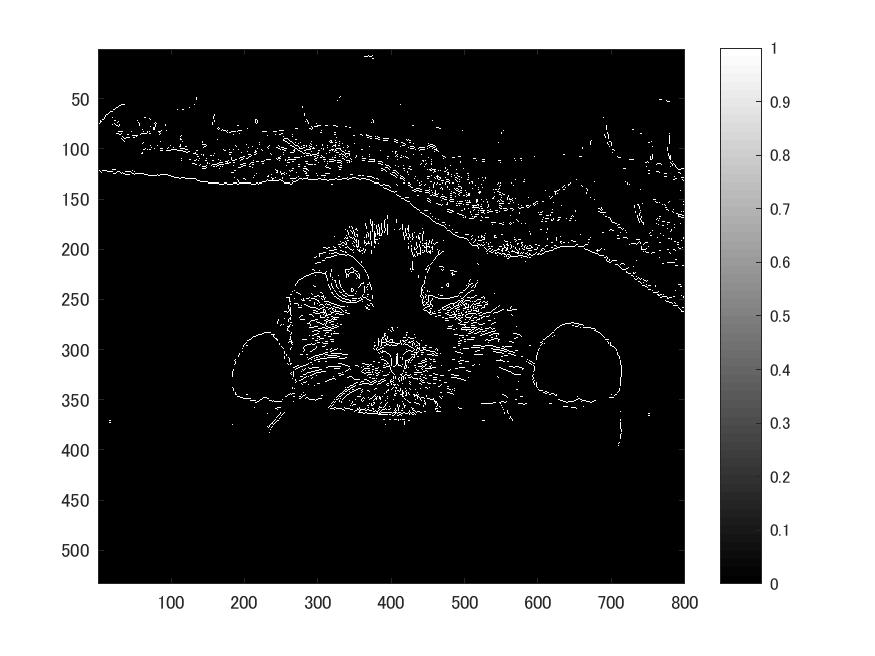
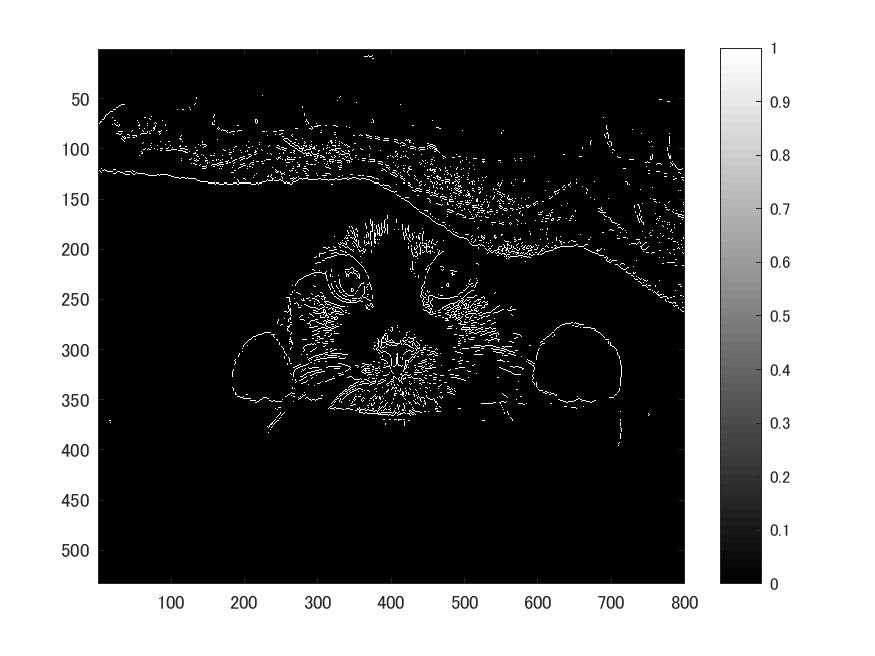
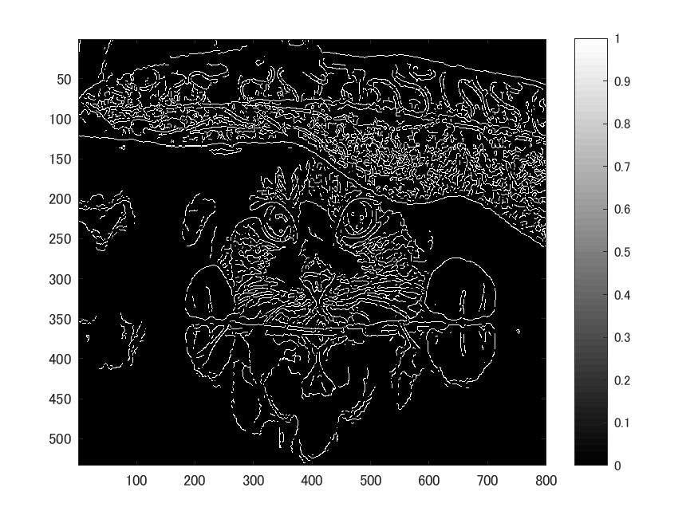

# 課題10 画像のエッジ抽出  
ここでは、エッジ検出について確認する。  
  課題2同様、白黒画像を用いる為次のコードを記述する。  
   
>> ORG = imread('Nuko.jpg');  
>> ORG= rgb2gray(ORG);  
>> imagesc(ORG); colormap(gray); colorbar;
>> pause;  
  
  
図1 白黒画像  
  
## エッジ抽出（プレウィット法）  
  
>> IMG = edge(ORG,'prewitt');  
imagesc(IMG); colormap('gray'); colorbar;  
pause;  
  
  
図2 エッジ抽出画像(プレウィット法)  
  
## エッジ抽出（ソベル法）  
  
>> IMG = edge(ORG,'sobel');  
imagesc(IMG); colormap('gray'); colorbar;  
pause;  
  
  
図3 エッジ抽出画像(ソベル法)　　
　　
## エッジ抽出（キャニー法）  
  
>> IMG = edge(ORG,'canny');  
imagesc(IMG); colormap('gray'); colorbar;  
pause;  
  
  
図4 エッジ抽出画像(キャニー法)
